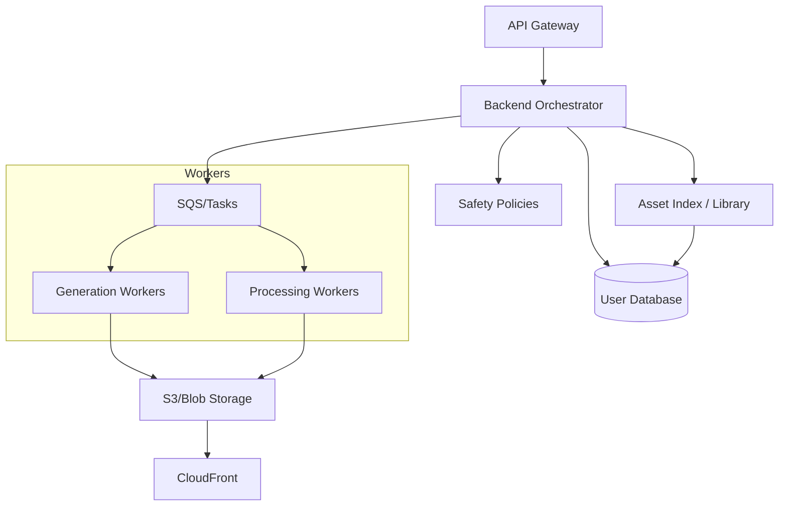

# Backend Orchestrator

This layer handles all server-side logic before assets enter the generation pipeline and persists state after each step. It retrieves project context from the database, enforces policies, creates jobs, and records outputs.

## Responsibilities

- Authenticate and apply quota limits per user/project.
- Retrieve project context, style DNA, and constraints from the database.
- Normalize and validate input payloads.
- Enforce content safety policies.
- Create and track jobs, route to appropriate services (2D/3D branches).
- Persist step status, artifacts, and metadata back to the user database.
- Manage versioned Asset Library indexing (images, meshes, FBX/GLTF, textures).

## High-Level Architecture

## Data Model (Conceptual)

- Job
  - id, project_id, asset_type, status, created_at
  - steps: [text_to_image, refine, retopo, rig, anim, export]
  - current_step, user_decisions, error
- Step
  - name, status(pending|running|paused|approved|rejected|done), started_at, finished_at
  - artifacts: urls to images/mesh/fbx/textures
  - metrics: duration, gpu_type, cost_estimate
- Asset
  - id, project_id, version, type(2D|3D), files[], metadata
  - library_path, cdn_url

## Request Lifecycle

1. Receive request from API Gateway.
2. Authenticate, check quotas, load project context from DB.
3. Validate inputs, apply safety policies.
4. Create Job record and initial Step entry.
5. Dispatch to workers; subscribe to events per step.
6. On step completion, persist status + artifacts to DB; decide next step.
7. On user review, update decision and resume/rewind step accordingly.
8. On export, index artifacts in Asset Library and update DB records.

## Example Endpoints

- POST /jobs
- GET /jobs/{id}
- POST /jobs/{id}/review
- GET /projects/{id}/assets
- GET /assets/{id}

## Event Schema (Conceptual)

- StepStarted
  - job_id, step_name, correlation_id, ts
- StepCompleted
  - job_id, step_name, artifacts[], metrics, ts
- StepFailed
  - job_id, step_name, error_code, error_message, ts
- UserReviewUpdated
  - job_id, step_name, decision(approved|rejected|paused), notes, ts
- AssetIndexed
  - asset_id, project_id, version, files[], metadata, ts

## Idempotency & Outbox

- Idempotency keys per step:
  - hash(project_id, asset_type, step_name, inputs, seed, model_version)
- Outbox pattern:
  - write DB changes and event atomically; async publisher flushes to bus (EventBridge/Kafka).
- Correlation:
  - propagate correlation_id across workers for tracing.

## Retry & DLQ

- Retries with exponential backoff and jitter; max attempts per step.
- Dead Letter Queue for manual intervention on unrecoverable errors.
- Circuit breakers at service level; fallback routing or pause.

## Persistence at Each Step

- Text-to-Image: image URLs, seed, prompt used
- Refine/Upscale: refined image URLs, operations applied
- Retopo: mesh URL, poly count, UV info
- Rig: armature schema, weight maps
- Animation: clip URLs, duration, fps
- Export: FBX/GLTF URLs, texture set, engine notes

## Notes

- Prefer versioned keys for deterministic indexing; avoid pipeline re-entry.
- Use signed URLs for private assets; expose via CDN for global delivery.
