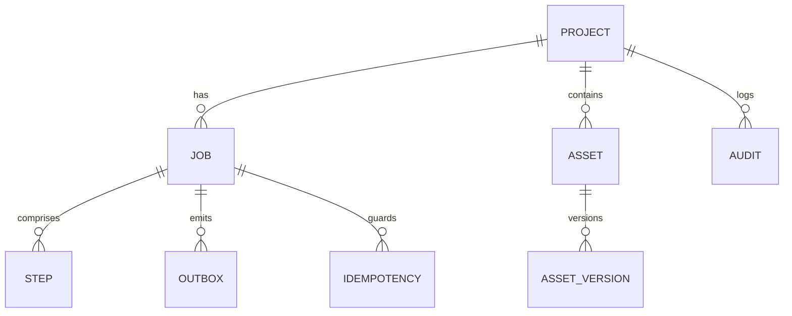

# Database Design

This document defines the data model and access patterns for the Asset Creator AI Core. It supports both DynamoDB (recommended for serverless/event-driven scale) and Postgres (alternative for relational needs).

## Goals

- Persist job/step status, artifacts, metrics at every pipeline stage
- Provide fast queries for UI (progress, asset browsing) and backend orchestration
- Ensure idempotency, event outbox, audit trails, and multi-tenant isolation
- Enable optional global replication and disaster recovery

## Entities

- **Project**: creative context, settings, quotas
- **Job**: end-to-end asset creation request (links steps and decisions)
- **Step**: pipeline stage status and artifacts (text-to-image, refine, 3D, retopo, rig, anim, export)
- **Asset**: a versioned deliverable (2D/3D) with files and metadata
- **Outbox Event**: reliable events for downstream processing
- **Idempotency Key**: prevents duplicate execution
- **Audit Log**: user decisions and system actions

---

## DynamoDB (Recommended)

### Single-Table Design

- Table: `asset_creator`
- PK/SK pattern for flexible queries

Item types and keys:

- Project
  - `PK = PROJECT#<project_id>`
  - `SK = PROJECT#<project_id>`
  - fields: name, style_profile, quotas, created_at
- Job
  - `PK = PROJECT#<project_id>`
  - `SK = JOB#<job_id>`
  - fields: asset_type, status, current_step, created_at, updated_at
- Step
  - `PK = JOB#<job_id>`
  - `SK = STEP#<step_name>#<ts>`
  - fields: status, artifacts[], metrics{}, error, approved_by, decided_at
- Asset Version
  - `PK = PROJECT#<project_id>`
  - `SK = ASSET#<asset_id>#V#<version>`
  - fields: type(2D|3D), files[], metadata{}, cdn_url, created_at
- Outbox
  - `PK = OUTBOX#<event_id>`
  - `SK = OUTBOX#<event_id>`
  - fields: type, payload{}, status(pending|published), ts
- Idempotency
  - `PK = IDEMPOTENCY#<key>`
  - `SK = IDEMPOTENCY#<key>`
  - fields: job_id, step_name, created_at, ttl
- Audit
  - `PK = PROJECT#<project_id>`
  - `SK = AUDIT#<ts>#<actor>`
  - fields: action, details

### GSIs

- `GSI1` (Jobs by Status)
  - `GSI1PK = JOB_STATUS#<status>`
  - `GSI1SK = <updated_at>`
- `GSI2` (Steps by Status)
  - `GSI2PK = STEP_STATUS#<status>`
  - `GSI2SK = <ts>`
- `GSI3` (Assets by Type)
  - `GSI3PK = ASSET_TYPE#<type>`
  - `GSI3SK = <created_at>`

### Access Patterns

- List jobs by project: `PK = PROJECT#pid` with SK begins_with `JOB#`
- Get job: `PK = PROJECT#pid`, `SK = JOB#jid`
- List steps by job: `PK = JOB#jid`
- Get latest asset version: query `PK = PROJECT#pid` with SK begins_with `ASSET#aid#V#` and sort desc
- Browsing assets by type/time: query GSI3
- Jobs in progress: query GSI1 with `JOB_STATUS#running`
- Steps awaiting review: query GSI2 with `STEP_STATUS#paused`

### Example Items

```json
{
  "PK": "PROJECT#prj_001",
  "SK": "JOB#job_123",
  "asset_type": "3D_CHARACTER",
  "status": "running",
  "current_step": "retopo",
  "created_at": "2026-01-29T08:00:00Z",
  "updated_at": "2026-01-29T08:15:00Z",
  "GSI1PK": "JOB_STATUS#running",
  "GSI1SK": "2026-01-29T08:15:00Z"
}
```

---

## Postgres (Alternative)

### Tables

- `projects(id, name, style_profile_json, quotas_json, created_at)`
- `jobs(id, project_id, asset_type, status, current_step, created_at, updated_at)`
- `steps(id, job_id, name, status, artifacts_json, metrics_json, error_json, decided_at, created_at)`
- `assets(id, project_id, type, latest_version, created_at)`
- `asset_versions(id, asset_id, version, files_json, metadata_json, cdn_url, created_at)`
- `outbox(id, type, payload_json, status, created_at)`
- `idempotency(id, key, job_id, step_name, created_at, ttl)`
- `audit(id, project_id, actor, action, details_json, ts)`

### Indexes

- `jobs(project_id, status)`
- `steps(job_id, status, name)`
- `asset_versions(asset_id, version DESC)`
- `outbox(status)`
- `idempotency(key)`

### Views (Optional)

- `v_jobs_in_progress`: jobs with status running
- `v_steps_needing_review`: steps with status paused
- `v_assets_by_type`: assets joined with latest_version metadata

---

## Outbox & Idempotency

- Outbox pattern: write DB changes and event item atomically; publisher flushes to EventBridge/Kafka
- Idempotency keys: `hash(project_id, asset_type, step_name, inputs, seed, model_version)` with TTL to avoid duplicates

## Retention & TTL

- Steps and jobs: retain 90 days; archive to cold storage thereafter
- Asset versions: retain latest N (configurable); archive older versions
- Idempotency: TTL 24–72h

## Security & Multi-Tenancy

- Per-project namespace keys (DynamoDB PK prefix) and RLS (Postgres) for isolation
- Signed URLs for asset access; audit user actions and exports
- Optional Global: DynamoDB Global Tables or Postgres read replicas

## ER Diagram (Conceptual)



## Notes

- Choose DynamoDB for serverless scale and event fanout; choose Postgres if you need complex relational queries or transactions across entities.
- Align DB writes with the pipeline HITL checkpoints and backend orchestrator events to ensure consistent UI state.
