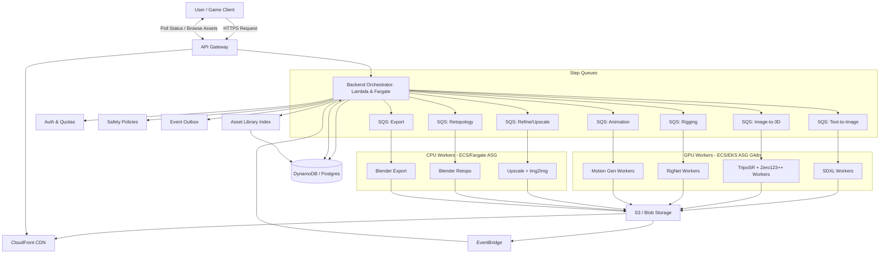

# Server Deployment & Auto-Scaling Architecture

This document outlines the infrastructure design for deploying the Asset Creator AI Core to AWS, ensuring scalability for a large user base and optimizing costs.

## 🏗 Architecture Diagram

This design aligns with the updated pipeline and backend orchestration.

### Key Components

1.  **API Gateway + Backend Orchestrator (Lambda/Fargate)**: Entry layer; retrieves project data, enforces policies, creates jobs, persists state, and routes to step queues.
2.  **Per-Step SQS Queues**: Isolate workloads and scale granularly (TTI, Refine, 3D, Retopo, Rig, Anim, Export).
3.  **GPU ASG (G4dn)**: Runs SDXL, TripoSR, RigNet, Motion; Spot for burst, On-Demand baseline to reduce cold starts.
4.  **CPU ASG / Fargate**: Runs Upscale/Img2Img, Retopo, Export; cheaper compute for CPU-heavy steps.
5.  **S3 + CloudFront**: Artifact storage and global delivery; versioned library paths and signed URLs.
6.  **EventBridge + Outbox**: Event bus for step completion; outbox ensures atomic DB + event publishing.
7.  **DB (DynamoDB/Postgres)**: Job, Step, Asset records; audit trail, metrics, lineage.

---

## 💰 Cost Analysis

### 1. Compute Pricing (AWS G4dn.xlarge)

_Region: us-east-1 (N. Virginia)_
_Specs: 4 vCPU, 16GB RAM, NVIDIA T4 GPU (16GB VRAM)_

| Pricing Model  | Cost per Hour | Cost per Minute |
| -------------- | ------------- | --------------- |
| **On-Demand**  | $0.526        | ~$0.0088        |
| **Spot (Avg)** | ~$0.158       | ~$0.0026        |

### 2. Job Cost Calculation (Per Asset)

_Estimates based on typical inference times._

#### Scenario A: Full 3D Character Pipeline

1.  **Text → Image (SDXL)**: ~10 seconds
2.  **Image → 3D (TripoSR)**: ~15 seconds
3.  **Retopology (Blender)**: ~60 seconds (runs on CPU ASG/Fargate)
4.  **Rigging (RigNet)**: ~45 seconds
5.  **Overhead (Loading models/Boot)**: ~30 seconds

**Total Time**: ~160 seconds (2.67 minutes)

**Cost per Character (Spot Price, GPU time only):**
$$ (10 + 15 + 45) \text{ s} \times \$0.0026/\text{min} \approx \mathbf{\$0.004} $$
**CPU time** (Retopo/Export): negligible cost on Fargate/ASG at scale; storage/egress dominates for large assets.

**Cost per Character (On-Demand):**
$$ 2.67 \text{ min} \times \$0.0088 \approx \mathbf{\$0.023} $$

### 3. Initial & Fixed Costs (Monthly)

Before any users arrive, you pay for the baseline infrastructure.

| Component                     | Est. Monthly Cost | Notes                                           |
| ----------------------------- | ----------------- | ----------------------------------------------- |
| **Application Load Balancer** | ~$16.00           | Optional if using API Gateway HTTP API directly |
| **NAT Gateway**               | ~$32.00           | Required for private subnets to download models |
| **S3 Storage**                | Variable          | Pay for what you store (~$0.023/GB)             |
| **DynamoDB**                  | Free Tier         | Fits within free tier for startup               |
| **Container Registry (ECR)**  | ~$1.00            | Storing Docker images                           |

**Base Monthly Cost**: **~$50 - $60** (can be reduced to ~$5 by avoiding NAT Gateway/ALB in dev).

---

## 📈 Auto-Scaling Strategy

To handle "large user base" spikes:

1.  **Metrics**: CloudWatch Alarms per step queue depth; scale corresponding worker pools independently.
2.  **Capacity Providers**:
    - **GPU**: Base 1–2 On-Demand; Burst via Spot (target tracking on queue depth).
    - **CPU**: Scale via Fargate or CPU ASG; target tracking on queue depth and CPU.
3.  **Warm Pools & AMI Baking**: Pre-baked GPU AMIs; warm pools for near-instant capacity.
4.  **Step Prioritization**: Interactive steps (TTI/Refine) prioritized over batch (Anim) to improve UX.

### Cold Start Mitigation (Critical for Production)

Cold starts (3-5 minutes) occur when a new GPU instance launches. This is unacceptable for interactive users.

#### 1. AMI Baking (The Foundation)

Instead of installing drivers and downloading models on boot, create a pre-baked Amazon Machine Image (AMI).

- **Packer**: Use HashiCorp Packer to build an AMI that has:
  - NVIDIA Drivers & CUDA Toolkit installed.
  - Docker engine ready.
  - **Model Weights Cached**: Pre-download SDXL, TripoSR, and RigNet weights into the Docker image or `/data` directory.
- **Result**: Instance boot time drops from ~5 min to ~45 seconds.

#### 2. Warm Pools (Instant Availability)

AWS Auto Scaling Warm Pools allow you to keep instances in a "Stopped" (Hibernated) state.

- **How it works**: Instances are pre-initialized (booted, app started) and then stopped.
- **Benefit**: Waking a stopped instance takes seconds, not minutes.
- **Cost**: You only pay for EBS storage while stopped, not the expensive GPU compute.

#### 3. Over-Provisioning (Buffer)

Always keep slightly more capacity than currently needed.

- **Step Scaling**: If queue > 1, add 2 instances immediately.
- **Target Tracking**: Maintain CPU utilization at 40% (instead of 70%) to leave headroom for spikes.

#### 4. Request Queuing UX

Even with optimization, waiting 30s is possible.

- **UX Pattern**: Return a `job_id` immediately. Show a progress bar or "Position in queue: 5" on the client side.
- **Optimistic UI**: Show a placeholder or low-res preview instantly if possible.

## 🌍 Global Delivery (Overseas Support)

To serve users globally (Asia, Europe, US) without deploying expensive GPU clusters in every region, use a **Hub-and-Spoke** model.

### 1. Compute Strategy: Single Hub (Cost Efficient)

Generative AI tasks take **seconds to minutes**. Adding 100ms latency by sending requests to a US server is negligible compared to the 2-minute generation time.

- **Recommendation**: Keep all GPU workers in one region (e.g., `us-east-1` or `us-west-2`) where Spot instances are cheapest and most abundant.

### 2. Asset Delivery: Global CDN (Performance Critical)

Users care about how fast they can **view/download** the result.

- **Amazon CloudFront**: Place a CDN in front of your S3 bucket.
- **Benefit**: A user in Tokyo downloads the generated 3D model from a Tokyo Edge Location, not from Virginia. This speeds up large file downloads (GLB/Textures) by 5-10x.

### 3. Architecture Update for Global Reach

Use single-region GPU hub with global CDN; backend remains centralized; assets delivered from nearest edge.

## 🚀 Deployment Checklist

1.  [ ] **Dockerize Services**: Create Dockerfiles for each service folder (`text-to-image-service`, `rigging-service`, etc.).
2.  [ ] **Build & Push to ECR**: Push images to Amazon Elastic Container Registry.
3.  [ ] **Define Infrastructure (Terraform/CDK)**: VPC, step SQS queues, GPU/CPU ASGs/Fargate, EventBridge, DB, CloudFront.
4.  [ ] **Configure User Data**: GPU AMI baking, warm pools; worker boot scripts to subscribe to step-specific queues.

---

## ⏱ Latency Per Step & Optimization

### Typical Latency (Interactive Path)

- **Backend Orchestrator**: 50–150 ms (auth, quotas, DB fetch, safety)
- **Text → Image (SDXL, GPU)**: 6–12 s
- **Refine/Upscale (CPU/GPU)**: 2–6 s (2×; tile-based can add 1–2 s)
- **Image → 3D (TripoSR, GPU)**: 12–20 s
- **Retopology (Blender, CPU)**: 45–90 s (mesh size dependent)
- **Rigging (RigNet, GPU)**: 30–60 s
- **Animation (MDM/MoDi, GPU)**: 20–40 s (clip length/fps dependent)
- **Export (Blender, CPU)**: 5–15 s
- **Index + CDN**: 0.5–2 s (S3 put + metadata write; download latency depends on asset size)

### Queue Wait (Variable)

- **Goal**: <2 s for interactive steps (TTI/Refine); <10–30 s for batch steps (Anim).
- **Tactics**: priority queues, target tracking on depth, reserve baseline GPU capacity.

### Optimization Playbook

- **Boot & Model Load**
  - AMI baking with preinstalled drivers and cached weights
  - Warm pools to avoid cold boot; keep 1–2 baseline GPUs online
  - Persistent workers with pinned models to skip reload between jobs
- **Inference**
  - Mixed precision (fp16) on T4; TensorRT for supported models
  - Smaller resolutions on first pass; staged upscale only if approved
  - Deterministic seeds for reproducibility; skip unnecessary reruns
- **3D Pipeline**
  - Enforce symmetry before rigging; reduces rigging time/failures
  - Use Instant Meshes for fast retopo on high-poly assets
  - Draco/KTX2 compression for GLB/textures to cut transfer time
- **System**
  - Per-step queues; interactive steps prioritized
  - Parallelize CPU tasks (retopo/export) while GPU runs next steps
  - Outbox events + idempotency to avoid duplicate work on retries

### Overseas Latency

- **API Path**: add Global Accelerator or edge‑optimized API Gateway (20–80 ms improvement)
- **Asset Delivery**: CloudFront serves from nearest edge; large assets benefit 5–10× vs origin
- **Compute**: single-region GPU adds ~100–200 ms RTT, negligible relative to 20–120 s compute

### SLO Targets (Recommended)

- **TTI**: P50 8 s, P95 12 s
- **Refine**: P50 3 s, P95 6 s
- **3D**: P50 15 s, P95 22 s
- **Retopo**: P50 60 s, P95 90 s
- **Rig**: P50 40 s, P95 60 s
- **Anim**: P50 30 s, P95 45 s
- **Export**: P50 10 s, P95 15 s
