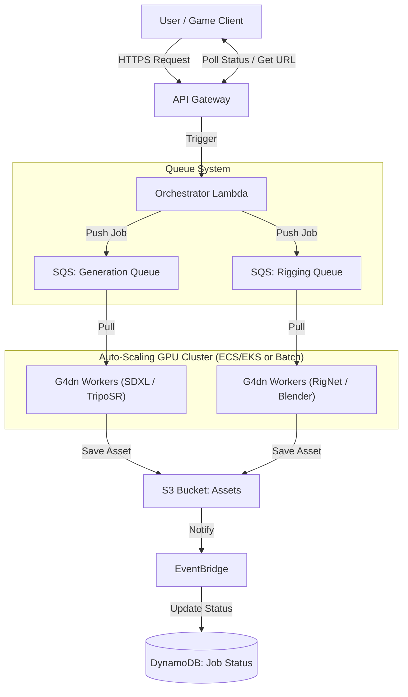

# Server Deployment & Auto-Scaling Architecture

This document outlines the infrastructure design for deploying the Asset Creator AI Core to AWS, ensuring scalability for a large user base and optimizing costs.

## 🏗 Architecture Diagram

The system uses an **Event-Driven Architecture** to handle long-running generative tasks (3D generation, Rigging) asynchronously.

```mermaid
graph TD
    User[User / Game Client] -->|HTTPS Request| API[API Gateway]
    API -->|Trigger| Lambda[Orchestrator Lambda]

    subgraph "Queue System"
        Lambda -->|Push Job| SQS_GEN[SQS: Generation Queue]
        Lambda -->|Push Job| SQS_RIG[SQS: Rigging Queue]
    end

    subgraph "Auto-Scaling GPU Cluster (ECS/EKS or Batch)"
        SQS_GEN -->|Pull| Worker_Gen[G4dn Workers (SDXL / TripoSR)]
        SQS_RIG -->|Pull| Worker_Rig[G4dn Workers (RigNet / Blender)]
    end

    Worker_Gen -->|Save Asset| S3[S3 Bucket: Assets]
    Worker_Rig -->|Save Asset| S3

    S3 -->|Notify| EventBridge
    EventBridge -->|Update Status| DB[(DynamoDB: Job Status)]

    User <-->|Poll Status / Get URL| API
```

### Key Components

1.  **API Gateway + Lambda**: Stateless entry point. Very cheap, scales infinitely.
2.  **Amazon SQS**: Buffers requests. If 10,000 users click "Generate" at once, SQS holds the jobs so the servers don't crash.
3.  **Auto Scaling Group (ASG) of G4dn Instances**:
    - **Scale Out**: Triggered when `ApproximateNumberOfMessagesVisible` in SQS > 0.
    - **Scale In**: Triggered when queue is empty.
    - **Spot Instances**: Use Spot instances for ~70% cost savings on stateless workers.
4.  **S3**: Durable storage for generated images and models.

---

## 💰 Cost Analysis

### 1. Compute Pricing (AWS G4dn.xlarge)

_Region: us-east-1 (N. Virginia)_
_Specs: 4 vCPU, 16GB RAM, NVIDIA T4 GPU (16GB VRAM)_

| Pricing Model  | Cost per Hour | Cost per Minute |
| -------------- | ------------- | --------------- |
| **On-Demand**  | $0.526        | ~$0.0088        |
| **Spot (Avg)** | ~$0.158       | ~$0.0026        |

### 2. Job Cost Calculation (Per Asset)

_Estimates based on typical inference times._

#### Scenario A: Full 3D Character Pipeline

1.  **Text → Image (SDXL)**: ~10 seconds
2.  **Image → 3D (TripoSR)**: ~15 seconds
3.  **Retopology (Blender)**: ~60 seconds (CPU heavy, but running on GPU node for simplicity)
4.  **Rigging (RigNet)**: ~45 seconds
5.  **Overhead (Loading models/Boot)**: ~30 seconds

**Total Time**: ~160 seconds (2.67 minutes)

**Cost per Character (Spot Price):**
$$ 2.67 \text{ min} \times \$0.0026 \approx \mathbf{\$0.007} $$
_(Less than 1 cent per character)_

**Cost per Character (On-Demand):**
$$ 2.67 \text{ min} \times \$0.0088 \approx \mathbf{\$0.023} $$

### 3. Initial & Fixed Costs (Monthly)

Before any users arrive, you pay for the baseline infrastructure.

| Component                     | Est. Monthly Cost | Notes                                           |
| ----------------------------- | ----------------- | ----------------------------------------------- |
| **Application Load Balancer** | ~$16.00           | Optional if using API Gateway HTTP API directly |
| **NAT Gateway**               | ~$32.00           | Required for private subnets to download models |
| **S3 Storage**                | Variable          | Pay for what you store (~$0.023/GB)             |
| **DynamoDB**                  | Free Tier         | Fits within free tier for startup               |
| **Container Registry (ECR)**  | ~$1.00            | Storing Docker images                           |

**Base Monthly Cost**: **~$50 - $60** (can be reduced to ~$5 by avoiding NAT Gateway/ALB in dev).

---

## 📈 Auto-Scaling Strategy

To handle "large user base" spikes:

1.  **Metric**: CloudWatch Alarm on SQS Queue Depth.
    - _Alarm High_: `Messages > 10` → Add 1 Instance.
    - _Alarm Low_: `Messages == 0` for 5 mins → Remove 1 Instance.
2.  **Capacity Provider**: Mix **On-Demand** (Base capacity) and **Spot** (Burst capacity).
    - _Base_: 1 On-Demand instance (Always on to reduce cold start).
    - _Burst_: Up to 100+ Spot instances.

### Cold Start Mitigation (Critical for Production)

Cold starts (3-5 minutes) occur when a new GPU instance launches. This is unacceptable for interactive users.

#### 1. AMI Baking (The Foundation)

Instead of installing drivers and downloading models on boot, create a pre-baked Amazon Machine Image (AMI).

- **Packer**: Use HashiCorp Packer to build an AMI that has:
  - NVIDIA Drivers & CUDA Toolkit installed.
  - Docker engine ready.
  - **Model Weights Cached**: Pre-download SDXL, TripoSR, and RigNet weights into the Docker image or `/data` directory.
- **Result**: Instance boot time drops from ~5 min to ~45 seconds.

#### 2. Warm Pools (Instant Availability)

AWS Auto Scaling Warm Pools allow you to keep instances in a "Stopped" (Hibernated) state.

- **How it works**: Instances are pre-initialized (booted, app started) and then stopped.
- **Benefit**: Waking a stopped instance takes seconds, not minutes.
- **Cost**: You only pay for EBS storage while stopped, not the expensive GPU compute.

#### 3. Over-Provisioning (Buffer)

Always keep slightly more capacity than currently needed.

- **Step Scaling**: If queue > 1, add 2 instances immediately.
- **Target Tracking**: Maintain CPU utilization at 40% (instead of 70%) to leave headroom for spikes.

#### 4. Request Queuing UX

Even with optimization, waiting 30s is possible.

- **UX Pattern**: Return a `job_id` immediately. Show a progress bar or "Position in queue: 5" on the client side.
- **Optimistic UI**: Show a placeholder or low-res preview instantly if possible.

## 🌍 Global Delivery (Overseas Support)

To serve users globally (Asia, Europe, US) without deploying expensive GPU clusters in every region, use a **Hub-and-Spoke** model.

### 1. Compute Strategy: Single Hub (Cost Efficient)

Generative AI tasks take **seconds to minutes**. Adding 100ms latency by sending requests to a US server is negligible compared to the 2-minute generation time.

- **Recommendation**: Keep all GPU workers in one region (e.g., `us-east-1` or `us-west-2`) where Spot instances are cheapest and most abundant.

### 2. Asset Delivery: Global CDN (Performance Critical)

Users care about how fast they can **view/download** the result.

- **Amazon CloudFront**: Place a CDN in front of your S3 bucket.
- **Benefit**: A user in Tokyo downloads the generated 3D model from a Tokyo Edge Location, not from Virginia. This speeds up large file downloads (GLB/Textures) by 5-10x.

### 3. Architecture Update for Global Reach



## 🚀 Deployment Checklist

1.  [ ] **Dockerize Services**: Create Dockerfiles for each service folder (`text-to-image-service`, `rigging-service`, etc.).
2.  [ ] **Build & Push to ECR**: Push images to Amazon Elastic Container Registry.
3.  [ ] **Define Infrastructure (Terraform/CDK)**: Script the VPC, SQS, and ASG.
4.  [ ] **Configure User Data**: Script EC2 boot to pull from SQS and run the Docker container.
